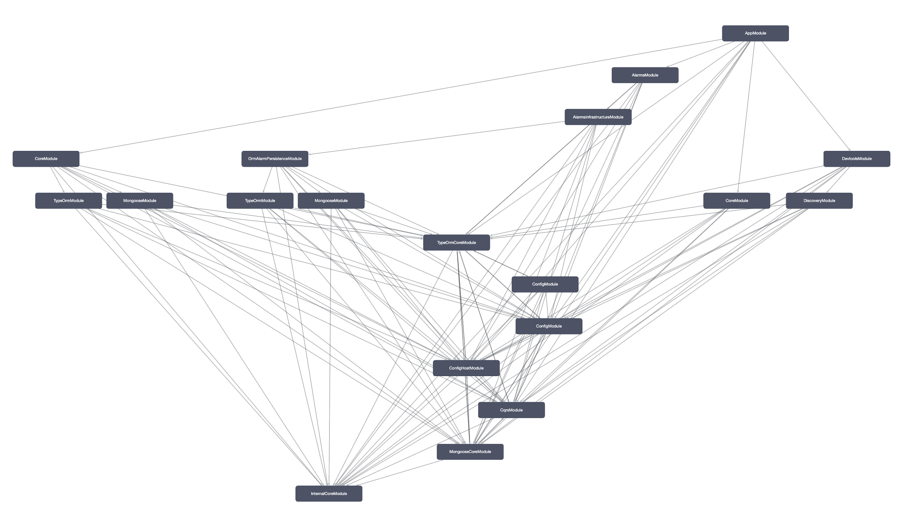

<p align="center">
  <a href="http://nestjs.com/" target="blank"></a>
</p>

## Project Description

This repository is a playground for a many powerful [NestJS](https://nestjs.com) architectural concepts & patterns used
in some of today's most complex Node.js systems in the real-world.

Topics covered so far:

- layered (N-tier) architecture
- hexagonal architecture in practice #1 [#dee7a18](https://github.com/egocentryk/nestjs-architecture-and-advanced-patterns/commit/dee7a18)
- hexagonal architecture in practice #2 [#8870700](https://github.com/egocentryk/nestjs-architecture-and-advanced-patterns/commit/8870700)
  - > ^ [#8870700](https://github.com/egocentryk/nestjs-architecture-and-advanced-patterns/commit/8870700) is a simple application that allows to create and fetch alarms, but **this application is much more than that**. Infrastructure
    > was decoupled from the application layer using the modules composition pattern. Now we can simply switch between different
    > infrastructure implementation without having to change the application layer itself. In this particular case we simply
    > switch between an in-memory database and a Postgres database via TypeORM.
- experimenting with CQRS #1 [#590a7b0](https://github.com/egocentryk/nestjs-architecture-and-advanced-patterns/commit/590a7b0)
- experimenting with CQRS #2 [#a3c0349](https://github.com/egocentryk/nestjs-architecture-and-advanced-patterns/commit/a3c0349)
- experimenting with CQRS #3 [#55d7ed1](https://github.com/egocentryk/nestjs-architecture-and-advanced-patterns/commit/55d7ed1)
  - > ^ [#55d7ed1](https://github.com/egocentryk/nestjs-architecture-and-advanced-patterns/commit/55d7ed1) this is really huge PR, but we've implemented the READ side of the CQRS pattern using MongoDB, so now application uses two different data stores (**PostgreSQL for WRITE and MongoDB for READ**). Upon receiving an event, system automatically creates a **denormalized alarm view** and stores it in the READ side database.
  - `docker-compose down --remove-orphans` & `docker-compose up -d`
  - `curl --location --request POST 'localhost:3000/alarms' \ --header 'Content-Type: application/json' \ --data-raw '{ "name": "Alarm 1", "severity": "HIGH", "triggeredAt": "2021-01-01T00:00:00.000Z", "items": [{ "name": "Item 1", "type": "TYPE_1" }, { "name": "Item 2", "type": "TYPE_2" }] }' | json_pp`
  - `curl http://localhost:3000/alarms | json_pp`
- implementing Event Store #1 [#d5a905b](https://github.com/egocentryk/nestjs-architecture-and-advanced-patterns/commit/d5a905b)
  - `docker-compose up -d event-store`
- more to come...

## Project Graph [Modules]



## Project setup

```bash
$ pnpm install
```

## Deployment

Check out [Mau](https://mau.nestjs.com), official platform for deploying NestJS applications on AWS.

## Resources

Check out a few resources that may come in handy when working with NestJS:

- Visit the [NestJS Documentation](https://docs.nestjs.com) to learn more about the framework.
- Deploy your application to AWS with the help of [NestJS Mau](https://mau.nestjs.com) in just a few clicks.
- Visualize your application graph and interact with the NestJS application in real-time using [NestJS Devtools](https://devtools.nestjs.com).

## License

Nest is [MIT licensed](https://github.com/nestjs/nest/blob/master/LICENSE).
